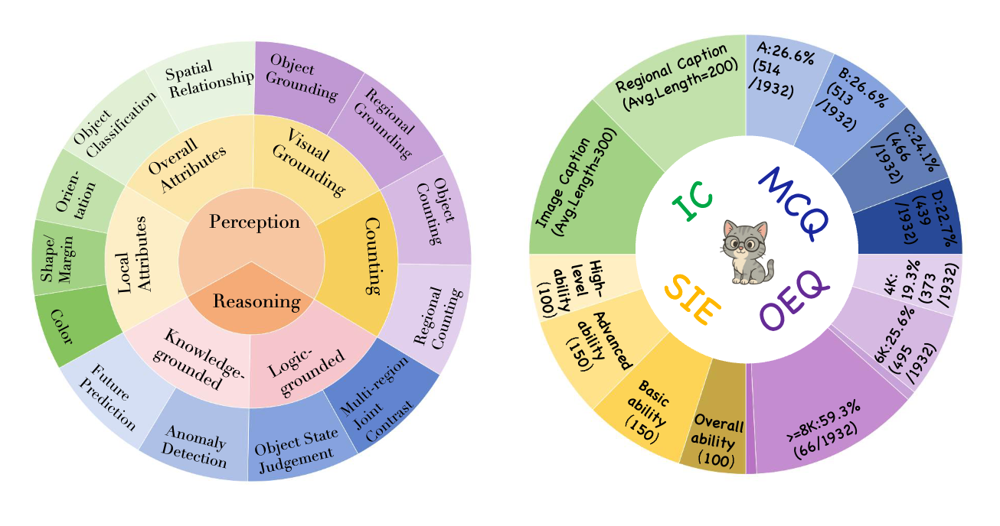
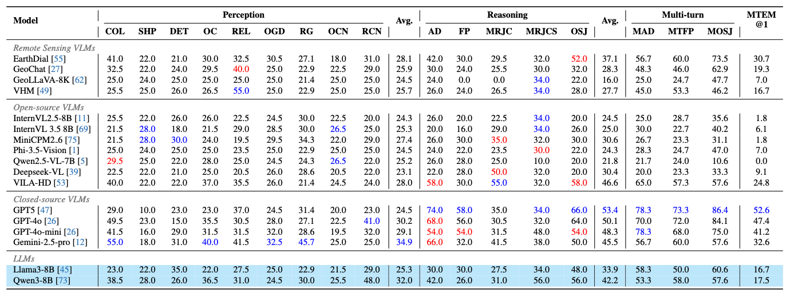
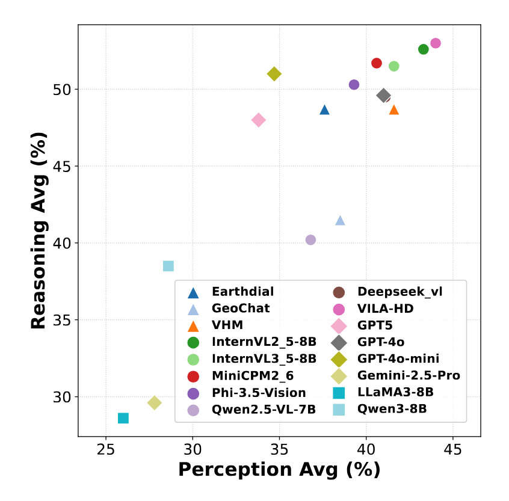
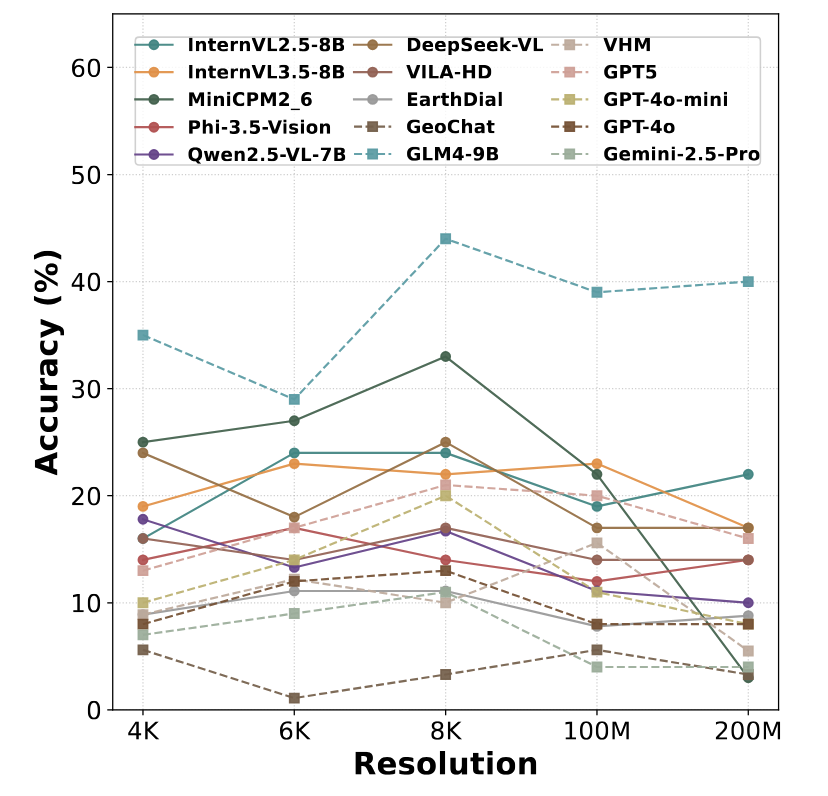

# *RSHR*: A Benchmark for MLLMs on Ultra-High-Resolution Remote Sensing Data

```
    If our project helps you, please give us a star ⭐ on GitHub to support us💕
```

## 🔥 News

- **`2025-11-14`** 🎉 We released the paper : *RSHR*: A Benchmark for MLLMs on Ultra-High-Resolution Remote Sensing Data.

## 😼*RSHR* Overview

- **Large-scale ultra-high-resolution benchmark:** RSHR is designed to evaluate fine-grained perception and complex reasoning of multimodal large language models in remote sensing, comprising **5,329 full-scene images** with native resolutions from **4K up to 3 × 10^8 pixels (300 MP)**.

- **Diverse expert-annotated data sources:** The dataset aggregates expert-annotated data from **DOTA-v2.0, MiniFrance, FAIRIM, HRSCD, XLRS-Bench**, and our own **100MP UAV-captured imagery**, covering a wide variety of real-world remote sensing scenarios.

- **Comprehensive tasks and rigorous evaluation pipeline:** RSHR spans **9 perception categories** and **4 reasoning types**, supporting both single-image and multi-image/multi-turn dialogues, and adopts a two-stage **Human–LLM Adversarial Verification** pipeline (LLM adversarial filtering + human review) to eliminate questions solvable by language priors alone, ensuring that models must truly see the image to answer.


### **🧠 Comprehensive Task Suite**

We categorize the evaluation into **four main task families** to support diverse usage scenarios, covering **9 perception categories** (e.g., Color, Orientation, Regional Grounding) and **4 reasoning types**.

- 🧩 **Multiple-Choice VQA (MCQ)**: Evaluates decision-making within a fixed answer space, covering both single-turn and multi-turn dialogues.
- ✍️ **Open-Ended VQA (OEQ)**: Assesses free-form visual understanding and compositionality without the reliance on option priors, offering a more accurate measure of MLLM capabilities.
- 📝 **Image Captioning (IC)**: Requires concise, accurate descriptions for both **Global** scenes (whole-image summary) and **Regional** details (directional sectors)。
- 🔍 **Single-Image Evaluation (SIE)**: A specialized protocol to test deep understanding of ultra-high-resolution images (4K to $3 \times 10^8$ pixels), probing multi-scale perception and reasoning on a per-image basis.




## 🔖Evaluation Results

We evaluated **14 state-of-the-art models**, including general-purpose MLLMs (e.g., GPT-4o, Gemini 1.5 Pro, Qwen2.5-VL) and remote-sensing specialist models (e.g., GeoChat, VHM). The evaluation covers **Multiple-Choice VQA**, **Open-Ended VQA**, and **Image Captioning**.

### 📊 1. Main Leaderboard (Multiple-Choice)

Closed-source models dominate the leaderboard, yet they still struggle with complex reasoning tasks requiring fine-grained visual evidence.




### 📉 2. Performance Analysis: Perception vs. Reasoning

We further analyze the correlation between perception and reasoning capabilities using Open-Ended VQA evaluation to avoid random guessing.




### 📏 3. Impact of Resolution (Key Insight)

Does higher resolution support lead to better performance? Our Single-Image Evaluation reveals a critical robustness issue.


